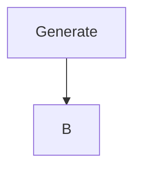
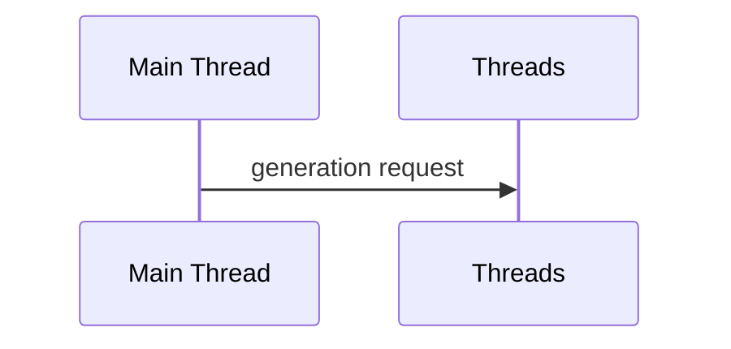

# Terrain generation
This project will serve as my high school final thesis and is focused on problematics of procedural generation.
I would like to adress performance from beginning and build everything with it in mind. 

This project is currently in sub beta state, so lot of features are missing.

---
## Target for beta release
- basic terrain generation
    - terrain will be limited to just island generation 
- dynamic LOD system
    - LOD for terrain (currently in development | mostly done)
    - LOD for foliege
- exposed setting for terrain generation

## Generation pipeline

## Proc-Gen algorithm 
1. sample heightmap (currently working on)
2. apply falloff map
3. generate infrastructure
    - roads, powerlines, houses

    - powerlines
        generate points across the map that follow certain rules
        connect these points together based on how far are they apart

4. generate foliege

## TODO
[ ] Separate renderer and generation tasks
[ ] Design Proc-gen algorithm